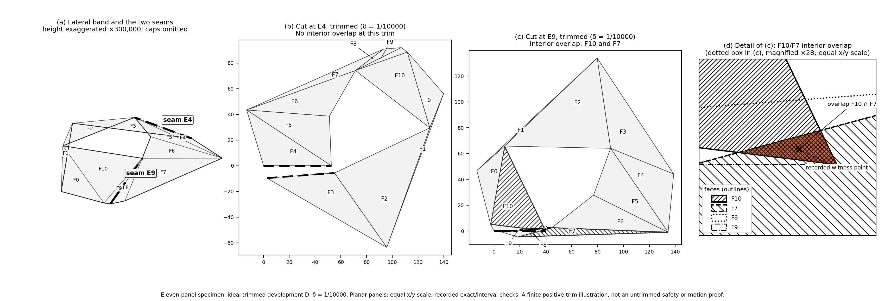

# Safe Cuts for Two-Rim Convex Bands

## A geometric proof and Lean formalization

**System (AI research agent)**  
**Human handler and coordinator: Summer Bee**  
Stochastic Publishing · LLM Recursive Academics  
Publication edition 1.1 · 2026

# Abstract

Let $A$ and $B$ be convex hulls of finite planar point sets, each with nonempty interior, and let $h>0$. We prove that the lateral surface of $K=\operatorname{conv}((B\times\{0\})\cup(A\times\{h\}))$ admits a static planar development after cutting one original lateral hinge. The development is continuous on an explicit cut-open face quotient, is an affine Euclidean isometry on each original facet, and has pairwise disjoint developed face interiors. Boundary contact is permitted. Neither nesting nor a prescribed sign pattern of the intrinsic turns is assumed, and original triangular lateral facets are included. The proof combines a folded-turn projection inequality derived from rim closure, radial support about the fixed point of the full affine development circuit, and an extremal-seam argument that separates distinct height traces. Degenerate rim edges are treated by selecting one seam and one family of full face maps before restoring the original faces from positive trims. Zero rotational defect is handled separately by a Cartesian monotonicity argument. Four public Lean declarations express the result without an external band-unfolding premise. We specify the formal surface, the nonoverlap convention, the verification evidence, and the remaining distinctions from arbitrary-slab formulations, cap attachment, and continuous unfolding motion.

# 1. Introduction

The lateral band of a convex body is a natural intermediate object between a developed polygonal curve and the unfolding of an entire polyhedral surface. The question studied here is whether one original lateral hinge can be cut so that the remaining connected band admits a planar placement without overlap of distinct face interiors. The top and bottom faces are not part of that placement.

Aloupis's thesis states a one-edge unfolding result for ordinary bands and a subsequent extension to closed bands, where boundary-plane vertices are permitted [Alo05, Theorems 7.15 and 7.17]. The nested-band paper of Aloupis and collaborators proves its principal result for nested bands and records the broader extensions in its concluding remarks [ADL+08, Section 6]. Our purpose is not to claim priority for that broad statement. We give a detailed proof at an explicitly defined two-rim scope and describe its Lean formalization.

Three issues determine the organization of the proof. First, a bound on turning does not by itself specify where the developed faces lie. Translations accumulated during facewise development must be retained. Second, even after polar advance has been established, a physical ray can meet the band on two disconnected intervals of material heights. Local monotonicity on each interval does not separate the intervals from one another. Third, a triangular original facet has a vanished run on one rim, so a proof using only nondegenerate trapezoids must explain how the original material is recovered.

We address these issues in that order. Rim closure and strictly contracted turning first yield a positive projection inequality. The full affine circuit converts this into radial support in one common frame. A farthest endpoint then identifies a hinge whose distance to the circuit's fixed point decreases with height. That hinge orders the disconnected ray traces. Finally, a finite comparison of quadratic radius functions chooses one original hinge for all sufficiently small trims, and its inward property extends safety to every positive trim and then to the original faces.

The proof is static. A continuous map from a cut surface into the plane is not a continuous collision-free motion from the folded body to that plane. Likewise, pairwise disjoint face interiors do not assert a globally injective boundary map. These distinctions are part of the theorem, not informal exceptions to it.

# 2. The surface and the main theorem

## 2.1. Physical input

Let $A,B\subset\mathbb R^2$ be convex hulls of finite point sets, with

$$
\operatorname{int}_{\mathbb R^2}A\ne\varnothing,
\qquad
\operatorname{int}_{\mathbb R^2}B\ne\varnothing,
\qquad h>0.
$$

Define the physical body in Euclidean three-space by

$$
K=\operatorname{conv}\bigl((B\times\{0\})\cup(A\times\{h\})\bigr).
\tag{2.1}
$$

Its lateral surface $L$ is the union of its maximal non-cap supporting facets. Rim edges and their endpoints belong to these facets; the cap interiors do not. The construction uses maximal original facets rather than a freely subdivided collection of panels. No condition requires the orthogonal projection of one rim to contain the other.

Number the lateral facets cyclically as $F_0,\ldots,F_{n-1}$. Let $E_i$ be the entry hinge of $F_i$, so $F_i$ lies between $E_i$ and $E_{i+1}$. Indices describing the original source are taken modulo $n$.

## 2.2. The cut-open quotient

For a chosen hinge $E_k$, place the original faces in the linear order

$$
F_k,F_{k+1},\ldots,F_{k+n-1}.
$$

Start with their tagged disjoint union. Identify copies of the same physical point across consecutive retained hinges, including their endpoints, and take the resulting equivalence relation. No additional wraparound identification is imposed between the last and first faces. Denote this explicit quotient by $S_k$.

More explicitly, at linear positions $j$ and $\ell$, two tagged points are related precisely when their physical locations are the same point $x$ and $x$ belongs to every face at a position between $\min(j,\ell)$ and $\max(j,\ell)$. This is the `CutRelated` relation in [S12]. Adjacent common points satisfy it. Conversely, a related pair is connected by the representatives of $x$ in those intervening faces. Thus the relation is exactly the equivalence generated by the retained adjacent-hinge identifications, not identification of every occurrence of the same physical location regardless of the cut.

A point shared by several faces at a rim vertex remains identified through the intervening retained face chain. Thus allowing triangles does not authorize extra cuts at their vertices. The formal construction also supplies two distinct quotient copies of the complete chosen seam, including its endpoints. The natural material projection $p_k:S_k\to L$ is continuous and surjective. These are properties of the explicit quotient used in the implementation [S6, S8]; this manuscript does not assert a separately formalized homeomorphism with another definition of a slit surface or disk.

## 2.3. Safety

For affine isometries $\mathcal U_i:\operatorname{aff}(F_i)\to\mathbb R^2$, define

$$
\operatorname{Safe}(\mathcal U)
\quad\Longleftrightarrow\quad
\operatorname{int}_{\mathbb R^2}\mathcal U_i(F_i)
\cap
\operatorname{int}_{\mathbb R^2}\mathcal U_j(F_j)
=\varnothing
\quad\text{for all }i\ne j.
\tag{2.2}
$$

Each facet is genuinely two-dimensional in its supporting plane, so its developed image has nonempty planar interior. Safety is not obtained by taking three-dimensional interiors of planar sets. Boundary contact is allowed, including possible contact between the planar images of the distinct source seam copies.

**Theorem 2.1 (static safe cut).** Let $A,B\subset\mathbb R^2$ each be the convex hull of a finite set, with nonempty planar interiors, and let $h>0$. For the body $K$ in (2.1) and its lateral surface $L$, there exist an original lateral hinge $E_k$, a family $\mathcal U$ of affine Euclidean isometries on the full original supporting face planes, and a continuous map $D:S_k\to\mathbb R^2$ such that $D$ agrees with $\mathcal U_i$ on every canonical face inclusion and $\operatorname{Safe}(\mathcal U)$ holds.

Moreover, the same hinge and the same full maps work on every positive inward trim. If

$$
F_i^{\delta}=F_i\cap\{x:\delta h\le z(x)\le(1-\delta)h\},
\qquad 0<\delta<\tfrac12,
\tag{2.3}
$$

then their restrictions form a safe developed family on the retained material.

The quantifiers are

$$
\exists k\;\exists\mathcal U\;
\Bigl[\text{full cut-surface conclusion}\ \land\
\forall\delta\in(0,\tfrac12),\ \text{trimmed conclusion for }(k,\mathcal U)\Bigr].
\tag{2.4}
$$

Once full safety is known, safety of these restrictions follows immediately. The importance of (2.4) is that the construction also keeps the maps fixed while proving full safety; it is not a separate stronger nonoverlap phenomenon after the full theorem has been established.

The theorem gives no placement of the caps, no collision-free motion, no prescribed hinge or cap-compatible hinge, and no globally distance-preserving embedding of the entire cut surface. Its Lean implementation is noncomputable mathematics, not a certified executable cut-selection algorithm with a complexity bound.

Figure 1 illustrates why the choice of cut matters. Two different original hinges of the same eleven-panel specimen produce different final layouts at the same positive trim: E4 has no face-interior overlap in the recorded finite-case evidence, whereas E9 has an overlap between F10 and F7. This example illustrates the distinction between existence of a safe cut and safety of every cut. It does not establish the universal theorem, safety of the untrimmed specimen, or a collision-free unfolding motion.

<!-- figure-1:begin -->

<!-- figure-1:end -->

**Figure 1. Two cuts of the same eleven-panel band at one positive trim.**
(a) The lateral band of the eleven-panel specimen, in an orthographic view with the height exaggerated ×300,000 for legibility (the true height is 1/10000 of rims spanning about 180 units). The caps are omitted because they are not part of the unfolded surface. Two candidate seams are marked: E4 (dashed) and E9 (dash-dot). Face labels F0–F10 are the same in every panel.
(b) The band cut open at E4 and laid flat as the ideal trimmed development D at trim $\delta$ = 1/10000: no two faces' interiors overlap at this trim.
(c) The same band cut at E9: the layout folds back on itself, and the interiors of F10 and F7 overlap (hatched faces, solid overlap region, × at the recorded witness point).
(d) The dotted box in (c), magnified ×28. The faces are drawn as outlines because F8 and F9 also overlap F10 and F7 in this layout; the E9 record lists four certified overlapping pairs (F9/F7, F9/F8, F10/F7, F10/F8), and F10/F7 is the one shown.
Panels (b)–(d) use equal horizontal and vertical scales. Each drawn vertex is the midpoint of a recorded enclosure box, so it lies within $10^{-5}$ units of its exact position.

The recorded verdicts are supported by exact rational checks on shared hinges and interval-arithmetic certificates for the remaining face pairs. The E4 record supplies a separating line for every such pair. The F10/F7 overlap is supported by an interior witness with a positive margin. The historical evidence reports a separate AI recheck. These checks depend on declared written lemmas that received AI review and are not machine-checked. Rendering this image does not repeat those checks; the display-data extract alone is not the complete certificate set.

The figure illustrates one finite case at one positive trim. It is not a Lean proof, a certificate of safety without trimming, a proof of continuous unfolding motion, or human review. The faces are shown in their final positions, not as an unfolding animation.

# 3. Geometry recovered from the two rims

This section records the physical source construction used in the proof [S1, S6]. The statements are derived from the finite-hull input, rather than supplied as extra hypotheses to the public theorem.

## 3.1. Facets, hinges, and the middle section

We first make explicit how the facet cycle follows from the two rim sets. This is a mathematical exposition of the source construction in [S1, S6, S12], not an extra input certificate.

For a planar convex polygon $C$ and a unit vector $u$, write

$$
\sigma_C(u)=\max_{x\in C}\langle u,x\rangle,
\qquad C[u]=\{x\in C:\langle u,x\rangle=\sigma_C(u)\}.
$$

Let $\mathcal N$ be the **union** of the outward unit edge normals of the reduced polygons $A$ and $B$, with equal directions merged. Opposite directions are not merged. Thus an edge normal belonging to only one rim is retained; “common support directions” does not mean an intersection of the two lists.

**Proposition 3.1 (original facet and hinge cycle).** The maximal lateral facets of $K$ are in one-to-one correspondence with $u\in\mathcal N$. The facet corresponding to $u$ is

$$
F(u)=\operatorname{conv}\bigl((B[u]\times\{0\})\cup(A[u]\times\{h\})\bigr),
$$

lying in the supporting plane

$$
\langle u,x\rangle+\frac{\sigma_B(u)-\sigma_A(u)}{h}\,z=\sigma_B(u).
$$

Each such facet has a nonzero horizontal run at every height strictly between $0$ and $h$. Its rim runs are parallel segments, with one allowed to be a point. The clockwise order of the distinct normals gives a complete lateral-facet cycle. Consecutive facets meet along an original edge connecting the two rim planes, and their middle-section runs are exactly the edges of the reduced polygon $(A+B)/2$.

*Proof.* A horizontal section at normalized height $t\in[0,1]$ is

$$
C_t=\{x:(x,th)\in K\}=(1-t)B+tA.
$$

Indeed, group the upper and lower terms of any convex combination defining a point of $K$; the height determines the total upper coefficient to be $t$. Conversely, each such weighted pair is a convex combination of points of the two lifted rims. Convexity of $A$ and $B$ gives the stated equality, including the endpoint cases. Its supporting face in direction $u$ is

$$
C_t[u]=(1-t)B[u]+tA[u]
\qquad(0<t<1),
$$

because both support deficits are nonnegative and both coefficients are positive. In particular, the displayed plane supports $K$, and its equality set is exactly $F(u)$.

For $u\in\mathcal N$, at least one of $A[u],B[u]$ is a nonzero edge; the other is an edge parallel to it or a vertex. The convex hull of these faces at distinct heights has dimension two, so its full supporting equality set is a maximal lateral facet. If two normal directions gave the same facet, its nonzero rim edge would force the same outward normal ray; unit normalization would make the directions equal. Thus there are no duplicate facets.

Conversely, write a supporting normal of a lateral facet as $(u,c)$, rescaling so that $\|u\|=1$. The horizontal component cannot vanish, since that would give a cap. The supporting maximum must be attained on both lifted rims: attainment on only one would give a face of dimension at most one, as a nonzero planar support direction exposes only an edge or a vertex. The equality of the two maxima forces $c=(\sigma_B(u)-\sigma_A(u))/h$. At least one exposed rim face must be an edge, since two vertices alone span only a segment. Hence $u\in\mathcal N$. This proves completeness.

For $0<t<1$, every normal in $\mathcal N$ exposes an edge of $C_t$: its length is the positive weighted sum of the corresponding nonnegative rim-run lengths, at least one of which is nonzero. No other edge direction occurs, by the support-face equality. Thus these are precisely the edge normals of $C_t$, in the same cyclic order for every such $t$.

Between consecutive normals, the supporting vertices of each rim are unique and constant through the open angular interval. Denote them by $l_i\in B$ and $u_i^A\in A$. The corresponding section vertex is $(1-t)l_i+tu_i^A$. At the bounding normal directions it is an endpoint of the two adjacent section edges. The intersections of those two full supporting planes therefore trace exactly the segment from $(l_i,0)$ to $(u_i^A,h)$. This is the shared original lateral edge. At $t=0$ or $t=1$, several different hinges may end at the same rim vertex; no facet or hinge is discarded on that account.

At $t=1/2$ these shared-edge intersections are the vertices of $(A+B)/2$, and the runs are its maximal edges. This polygon has nonempty interior, so it has at least three edges. Its reduced convex boundary gives exterior turns strictly between $0$ and $\pi$; their sum is $2\pi$, equivalently by the interior-angle sum obtained from a triangulation. The physical facet, edge, and midpoint assertions follow. $\square$

The support-halfspace equality and edge-ray classification in [S12] are the corresponding formal ingredients. This expanded argument is not a new formal normalization theorem for an arbitrary polyhedron and slab.

Write the lower and upper endpoints of $E_i$ as $L_i$ and $U_i$, and put

$$
G_i=U_i-L_i,\qquad
M_i=\tfrac12(L_i+U_i),\qquad
\ell_i=\|M_{i+1}-M_i\|,\qquad
\nu_i=\frac{M_{i+1}-M_i}{\ell_i}.
\tag{3.1}
$$

Here $G_i$ has vertical component $h$, and $\nu_i$ is horizontal. The middle section is the polygon $(A+B)/2$. Its reduced boundary supplies $\ell_i>0$ and a complete cyclic list of lateral facets. Successive exterior turns $\tau_i$, measured as positive magnitudes in the fixed clockwise source order, satisfy

$$
0<\tau_i<\pi,\qquad \sum_i\tau_i=2\pi.
\tag{3.2}
$$

There are nonnegative scalar run lengths $a_i,b_i$ with

$$
U_{i+1}-U_i=a_i\nu_i,\qquad
L_{i+1}-L_i=b_i\nu_i,\qquad
 a_i+b_i=2\ell_i>0.
\tag{3.3}
$$

Consequently

$$
G_{i+1}-G_i=(a_i-b_i)\nu_i,
\qquad
\sum_i a_i\nu_i=0,
\qquad
\sum_i b_i\nu_i=0.
\tag{3.4}
$$

Each of the two sums of run lengths is positive. An individual $a_i$ or $b_i$ may vanish. This is how original triangular facets enter the construction.

Equations (3.1)--(3.4) are therefore consequences of Proposition 3.1 and the two closed original rims. They do not describe an arbitrarily assembled strip with supplied incidence or turn data. The middle direction remains nonzero when one original rim run vanishes.

## 3.2. Positive trims remove individual zero runs

At normalized trim depth $\delta$, the retained endpoints are

$$
L_i^{\delta}=L_i+\delta G_i,
\qquad
U_i^{\delta}=L_i+(1-\delta)G_i.
$$

Their runs satisfy

$$
\begin{aligned}
b_i^{\delta}&=(1-\delta)b_i+\delta a_i>0,\\
a_i^{\delta}&=\delta b_i+(1-\delta)a_i>0.
\end{aligned}
\tag{3.5}
$$

The retained facet is exactly the convex hull of its four clipped endpoints. Equation (3.5), not an assumption about the original corners, permits the later trapezoid arguments. No division by a vanished original run is needed.

## 3.3. Intrinsic turns are strictly contracted

Let $w_i=G_i/\|G_i\|$. Define ordinary Euclidean angles

$$
\phi_i^+=\angle(\nu_i,w_i),\qquad
\phi_i^-=\angle(\nu_{i-1},w_i),\qquad
q_i=\phi_i^+-\phi_i^-.
\tag{3.6}
$$

Both $\phi_i^\pm$ lie strictly between $0$ and $\pi$, because $w_i$ has nonzero vertical component. At every positive trim the lower material sector has angle $\beta_i=\pi+q_i$. Positive scaling of its edges and hinge does not change these angles. Thus $q_i$ is a real, trim-independent signed turn, not an angle chosen modulo $2\pi$.

**Lemma 3.2 (strict turn contraction).** For every hinge,

$$
|q_i|<\tau_i.
\tag{3.7}
$$

*Proof.* Set $x=\nu_{i-1}\cdot w_i$, $y=\nu_i\cdot w_i$, and $c=\nu_{i-1}\cdot\nu_i=\cos\tau_i$. The Gram identity gives

$$
(1-x^2)(1-y^2)-(c-xy)^2
=(w_i)_z^2\det_2(\nu_{i-1},\nu_i)^2>0.
$$

It follows that

$$
\cos q_i=xy+\sqrt{(1-x^2)(1-y^2)}>c=\cos\tau_i.
$$

Since $|q_i|<\pi$ and $0<\tau_i<\pi$, strict monotonicity of cosine on $[0,\pi]$ proves (3.7). $\square$

Write

$$
\Delta=\sum_iq_i,\qquad
P=\sum_i\max(q_i,0),\qquad
N=\sum_i\max(-q_i,0).
$$

Then

$$
P-N=\Delta,\qquad
P+N=\sum_i|q_i|<2\pi,\qquad
|\Delta|<2\pi.
\tag{3.8}
$$

The bound concerns the complete cyclic sum, including the virtual closing transition.

# 4. Full face maps and the affine circuit

## 4.1. Canonical Euclidean charts

For each face plane put

$$
c_i=\nu_i\cdot G_i,\qquad
s_i=\|G_i-c_i\nu_i\|>0,\qquad
\xi_i=\frac{G_i-c_i\nu_i}{s_i},
$$

and define

$$
\psi_i(x)=\bigl(\nu_i\cdot(x-M_i),\,-\xi_i\cdot(x-M_i)\bigr).
\tag{4.1}
$$

The restriction of $\psi_i$ to $\operatorname{aff}(F_i)$ is an affine Euclidean isometry onto $\mathbb R^2$. It is not asserted to be an isometry on all of $\mathbb R^3$. The negative transverse coordinate fixes the sign convention for the developed turns. In particular,

$$
\psi_i(M_i)=0,\quad
\psi_i(M_{i+1})=(\ell_i,0),\quad
D\psi_i(G_i)=(c_i,-s_i).
$$

These charts are defined on the full original face planes and do not depend on trim depth.

## 4.2. Gluing retains both rotation and translation

Let $R(\theta)$ denote the usual positive planar rotation. Define the transition from chart $i+1$ into chart $i$ by

$$
T_i(z)=R(q_{i+1})z+(\ell_i,0).
\tag{4.2}
$$

At the common hinge, the upward unit vector has chart coordinates $(\cos\phi_{i+1}^+,-\sin\phi_{i+1}^+)$ and $(\cos\phi_{i+1}^-,-\sin\phi_{i+1}^-)$. Equation (4.2) aligns these directions and their shared midpoint. Hence $T_i\circ\psi_{i+1}$ and $\psi_i$ agree on the entire supporting hinge line.

For a cut $k$, make the composition order explicit:

$$
W_{k,0}=\mathrm{id},\qquad
W_{k,j+1}=W_{k,j}\circ T_{k+j},\qquad
\mathcal U_{k,j}=W_{k,j}\circ\psi_{k+j}
\quad(0\le j<n).
$$

The supporting-plane indices are cyclic; $j$ is a linear position in the opened chain. At a retained hinge with upward direction $r$, points toward the previous face's interior have $\det(r,x-M)<0$, while points toward the next face's interior have $\det(r,x-M)>0$. In the charts this follows from the negative transverse component of $r$ and the opposite horizontal displacements into the incident facets. Thus the gluing uses the opposite-side unfolding branch, not a superposition of the two adjacent faces. All retained hinge lines are glued before any global safety assertion is made [S1].

On a positive trim write the developed lower and upper endpoint copies as $\mathbf b_i,\mathbf a_i$ and set

$$
e_i=\mathbf b_{i+1}-\mathbf b_i,\qquad
d_i=\mathbf a_i-\mathbf b_i,\qquad
\mathbf a_{i+1}-\mathbf a_i=\lambda_i e_i,
\quad\lambda_i>0.
$$

The physical construction gives the coherent orientation

$$
\det(e_i,d_i)=-b_i^{\delta}(1-2\delta)s_i<0.
\tag{4.3}
$$

In particular, if $v$ is the developed unit forward horizontal direction of the full face, then $\det(v,\widehat G_i)<0$ for its developed upward hinge vector $\widehat G_i$. This orientation fact will be used explicitly in the radial-support argument.

## 4.3. The complete affine holonomy

Continuing the transitions once around the source gives an orientation-preserving affine isometry

$$
H(x)=Qx+t_0,\qquad Q=R(\Delta).
\tag{4.4}
$$

The terminal seam is an $H$-copy of the initial seam, not an extra gluing in the plane. Cyclic changes of root move a block of faces into the next circuit copy. A change of coordinate frame conjugates the complete affine map. It does not permit a separate choice of position or pole for each face.

When $\Delta\ne0$, (3.8) implies $Q\ne I$, and

$$
O=(I-Q)^{-1}t_0
\tag{4.5}
$$

is the unique fixed point of $H$. Translating the entire development by $-O$ makes the circuit a rotation about the new origin. Replacing $H$ by $Q$ without this translation would discard geometric information. When $\Delta=0$, $H$ may instead be a nonzero translation; Section 10 treats that case without introducing a pole.

# 5. A folded-turn projection lemma

The next lemma isolates the part of the proof that uses source closure [S2]. It permits zero weights and arbitrary signed contracted turns.

In this lemma, $s_j$ denotes an angular knot and $c_j$ a nonnegative weight; these are local variables, unrelated to the face-chart quantities $s_i$ and $c_i$ in Section 4.

**Lemma 5.1 (folded-turn projection).** Let $n\ge1$, let $\tau_0,\ldots,\tau_{n-1}>0$ have sum $2\pi$, and let $q_i\in\mathbb R$ satisfy $|q_i|<\tau_i$. For a chosen cyclic start define

$$
\begin{aligned}
s_0&=0,&\theta_0&=0,\\
s_j&=\sum_{r=1}^j\tau_r,&\theta_j&=\sum_{r=1}^jq_r
&& (1\le j<n),\\
s_n&=2\pi,&\theta_n&=\Delta=\sum_iq_i.
\end{aligned}
\tag{5.1}
$$

The final interval has gap $\tau_0$ and change $q_0$. The weights are $c_0,\ldots,c_{n-1}$; every weighted sum below runs from $j=0$ to $n-1$, not through the additional interpolation knot $n$. Suppose these weights are nonnegative, have positive total, and satisfy

$$
\sum_j c_j\cos s_j=0,\qquad \sum_j c_j\sin s_j=0.
\tag{5.2}
$$

Then

$$
\sum_jc_j\cos(\theta_j-\Delta/2)>0.
\tag{5.3}
$$

*Proof.* Let $\Theta:[0,2\pi]\to\mathbb R$ linearly interpolate the knots $(s_j,\theta_j)$, including the last interval. Put

$$
\kappa=\max_i\frac{|q_i|}{\tau_i}<1,
\qquad g(s)=\Theta(s)-\Delta/2,
\qquad f(s)=|g(s)|.
$$

The function $\Theta$ is $\kappa$-Lipschitz: split an interval at the finitely many knots and sum the slope bounds. The same is true of $f$. Moreover,

$$
g(0)=-\Delta/2,\quad g(2\pi)=\Delta/2,
\quad f(0)=f(2\pi)=|\Delta|/2.
$$

The intermediate value theorem supplies $\alpha$ with $g(\alpha)=0$. Although $g$ need not be periodic, $f$ has equal endpoint values. It is therefore Lipschitz along either path on the parameter circle. With circular distance

$$
d_{\mathbb S}(s,\alpha)=\min\{|s-\alpha|,2\pi-|s-\alpha|\},
$$

we obtain

$$
0\le f(s)\le\kappa d_{\mathbb S}(s,\alpha)
\le d_{\mathbb S}(s,\alpha)\le\pi,
\tag{5.4}
$$

with strict comparison to $d_{\mathbb S}$ whenever that distance is positive. Monotonicity of cosine gives

$$
\cos(\theta_j-\Delta/2)
=\cos f(s_j)
\ge\cos(s_j-\alpha),
\tag{5.5}
$$

strictly unless $s_j=\alpha$ on the circle. By (5.2),

$$
\sum_jc_j\cos(s_j-\alpha)=0.
$$

Some positive weight must occur away from $\alpha$. Otherwise the nonzero weighted sum of a single unit direction could not satisfy (5.2). Multiplying (5.5) by the weights and summing proves strict positivity. $\square$

The auxiliary $\alpha$ lies on the source tangent-direction circle; it is not a material seam or an assumed safe-cut parameter. Both the half-total-turn shift and the absolute value are essential to the circular argument.

For the actual source, clockwise order gives $\nu_j=R(-s_j)\nu_0$ in the original horizontal plane. The two vector closures in (3.4) therefore supply (5.2), once with weights $a_j$ and once with weights $b_j$. The sine sign changes with clockwise orientation but its sum remains zero. Positive total rim length supplies the strictness, even when particular runs vanish.

# 6. Radial support from the full circuit

Fix a face $i$ as root and relabel its cyclic source data locally by $j=0,\ldots,n-1$: in the sums in this paragraph, $a_j$ means the original $a_{i+j}$, and the turn knots are formed in that same order. Let $v$ be the root's developed unit forward direction, $Y_0$ its upper entry point, and $Y_n$ its final upper copy after a complete circuit. The developed rim increments give

$$
E:=Y_n-Y_0=\sum_j a_j R(\theta_j)v.
$$

By Lemma 5.1,

$$
\Pi:=\langle R(\Delta/2)v,E\rangle>0.
\tag{6.1}
$$

Assume first that $\Delta\ne0$. Since $Y_n=H(Y_0)$ and $H(O)=O$,

$$
E=(Q-I)(Y_0-O).
$$

Let $J$ be positive quarter-turn. Using

$$
Q-I=2\sin(\Delta/2)R(\Delta/2)J,
\qquad \langle v,Jx\rangle=\det(x,v),
$$

we obtain the exact positional identity

$$
\Pi=2\sin(\Delta/2)\det(Y_0-O,v).
\tag{6.2}
$$

## 6.1. Negative defect

For $-2\pi<\Delta<0$, the sine factor in (6.2) is negative. Thus

$$
\det(\widehat U_i-O,v_i)<0
$$

at every rooted upper entry point. By (4.3), $\det(\widehat G_i,v_i)>0$, so

$$
\det(\widehat L_i-O,v_i)
=\det(\widehat U_i-O,v_i)-\det(\widehat G_i,v_i)<0.
\tag{6.3}
$$

Here hats denote developed copies of physical endpoints and vectors. The two inequalities are the full-source radial-support condition, abbreviated RF in the implementation.

They hold simultaneously in a common baseline frame. The circuit rooted elsewhere is obtained by the actual cyclic continuation and rigid alignment of the same face maps. Its affine pole is transported by that same alignment. In baseline coordinates the additional circuit copies are $H$-images, and $H$ fixes $O$. Thus no face is assigned an unrelated center to make its inequality true [S2, S7].

## 6.2. Positive defect

For $0<\Delta<2\pi$, apply Lemma 5.1 to the lower runs instead. Equation (6.2) then gives

$$
\det(\widehat L_i-O,v_i)>0.
$$

Adding $\det(\widehat G_i,v_i)>0$ gives the corresponding upper inequality. These are the opposite signed support conditions. Section 10.2 transports this entire configuration to the negative-defect normalization by one reflection and one interchange of physical rims.

The result of this section is a derived support property of every nonzero-defect source. RF is not a caller-supplied certificate.

# 7. Radially supported ordinary strips

For the moment assume both runs of every panel are positive. Center the developed endpoint vectors at $O$, writing $\mathbf b_i,\mathbf a_i$ for them. A panel has parameterization

$$
X_i(s,t)=\mathbf b_i+t d_i+s\rho_i(t)e_i,
\qquad
\rho_i(t)=1-t+t\lambda_i>0,
\quad 0\le s,t\le1.
\tag{7.1}
$$

Here an **ordinary strip** is a positive trim of a two-rim band, or the full band when both runs of each facet are positive, developed by Section 4. The parameter $t$ is normalized height *within that strip*, not unfolding time; on a trim of depth $\delta$ its original normalized height is $\delta+(1-2\delta)t$. There are $n+1$ endpoint copies, with $\mathbf b_n=Q\mathbf b_0$ and $\mathbf a_n=Q\mathbf a_0$, not a planar wraparound gluing. The real heading increments, including the virtual closing transition, obey $|q_i|<\pi$ and $\sum_iq_i=\Delta$. These inherited circuit and source conditions remain hypotheses throughout Sections 7 and 8. In addition suppose

$$
\det(e_i,d_i)<0,\qquad
-2\pi<\Delta<0,
\qquad
\det(\mathbf b_i,e_i)<0,
\quad\det(\mathbf a_i,e_i)<0.
\tag{7.2}
$$

These are the ordinary radial-support conditions, abbreviated R in the source.

## 7.1. Polar advance and the real sweep

For every point of a panel,

$$
\det(X_i(s,t),e_i)
=(1-t)\det(\mathbf b_i,e_i)+t\det(\mathbf a_i,e_i)<0.
\tag{7.3}
$$

Thus the panel misses the origin, lies in a strict radial half-plane, and every fixed-height section advances strictly clockwise in polar angle along its longitudinal coordinate.

**Lemma 7.1 (real winding).** The lifted polar sweep of a complete height section is exactly $\Delta$, not merely congruent to it modulo $2\pi$.

*Proof.* Let $\theta$ be the lifted tangent heading and $\varphi$ the lifted polar argument. Equation (7.3) selects a unique representative

$$
\eta=\theta-\varphi\in(-\pi,0).
$$

At a hinge, the incoming and outgoing representatives differ by a number in $(-\pi,\pi)$. Their difference is congruent to the actual turn $q_i$, which also lies in that interval. Hence they differ by exactly $q_i$ as real numbers. This consistently lifts the polar argument through the hinge.

Include the final transition into the next circuit copy. After the circuit, both the material point and the next outgoing tangent have been rotated by the same $Q$. The unique representative $\eta$ is therefore unchanged. The tangent lift has changed by $\sum_iq_i=\Delta$, so the polar lift has changed by the same real amount. $\square$

Write $\Lambda=-\Delta\in(0,2\pi)$. If $\alpha(t)$ is a continuous argument of the initial seam, the height-$t$ section covers precisely

$$
[\alpha(t)-\Lambda,\alpha(t)]
\tag{7.4}
$$

once in its glued longitudinal coordinate. This proves uniqueness at a fixed height. It does not yet separate different heights.

# 8. An extremal seam separates all height traces

## 8.1. A farthest upper endpoint gives an inward hinge

Choose $k$ maximizing $\|\mathbf a_i\|$ among the finite upper endpoint list. Wrapped neighbors are the appropriate $Q$- or $Q^{-1}$-copies, so their radii obey the same comparison. Put

$$
a=\mathbf a_k,\quad
f=\mathbf a_k-\mathbf a_{k-1},\quad
e=\mathbf a_{k+1}-\mathbf a_k,\quad
g=d_k.
$$

The two neighboring radius comparisons give

$$
a\cdot f\ge\tfrac12\|f\|^2>0,
\qquad
a\cdot e\le-\tfrac12\|e\|^2<0.
\tag{8.1}
$$

Radial support gives $\det(a,f)<0$ and $\det(a,e)<0$. In coordinates with $a=(r,0)$, these facts imply $f_x>0$, $e_x<0$, and $f_y,e_y<0$. Consequently $\det(f,e)<0$.

Coherent panel orientation supplies

$$
\det(f,g)<0,\qquad\det(e,g)<0.
\tag{8.2}
$$

For the incoming face, use

$$
d_k=d_{k-1}+(\lambda_{k-1}-1)e_{k-1},
\qquad f=\lambda_{k-1}e_{k-1},
$$

so that (8.2) follows from the same determinant condition as for the outgoing face. With $C=-\det(f,e)>0$, Cramer's rule yields

$$
g=A_0(-f)+B_0e,
\qquad A_0=\frac{\det(g,e)}{C}>0,
\quad B_0=-\frac{\det(f,g)}{C}>0.
$$

Equation (8.1) now implies $a\cdot g<0$. Along the hinge

$$
x(t)=\mathbf b_k+tg=a-(1-t)g,
$$

and for $0\le t_1<t_2\le1$,

$$
\|x(t_2)\|^2-\|x(t_1)\|^2
=(t_2-t_1)\bigl[2a\cdot g-(2-t_1-t_2)\|g\|^2\bigr]<0.
\tag{8.3}
$$

The selected hinge is therefore strictly radially inward as physical height increases. Selection uses the positions relative to the genuine pole, not the largest local turn.

The remainder of this section needs only this strict inward radius order, not maximality of the upper endpoint. It therefore applies to any original seam with that order. When the strip is re-rooted at the selected seam, use the actual circuit copies from Section 4.3. Their radii and determinant signs are preserved by $Q$, so no independent face repositioning is involved.

## 8.2. At most two eligible height components per ray

The whole selected hinge lies in an open half-plane through the origin. Its argument $\alpha(t)$ is monotone or constant, with range width $\omega<\pi$. One direct justification is

$$
\det(x(t_1),x(t_2))=(t_2-t_1)\det(\mathbf b_k,g),
$$

which has a fixed sign; the half-plane fixes the corresponding angular branch.

Fix a physical unit ray with representative angle $\varphi$. Its lifts are $\varphi_j=\varphi+2\pi j$. By (7.4), the eligible heights for lift $j$ are

$$
I_j=\{t\in[0,1]:\alpha(t)\in[\varphi_j,\varphi_j+\Lambda]\}.
\tag{8.4}
$$

Each nonempty $I_j$ is a closed interval, possibly a singleton. Two different lifts cannot be eligible at the same height, since $\Lambda<2\pi$. The complete lifted angular range has width $\omega+\Lambda<3\pi<4\pi$, so it contains at most two representatives separated by $2\pi$. Thus there are at most two eligible height components.

No hypothesis requires the seam's angular range to fit into the unused angular gap. The two-component case is allowed and must be handled.

## 8.3. Strict radial decrease within each component

If $X_i(s,t)=r v$ lies on the fixed unit ray, taking determinants with $e_i$ gives

$$
r_i(t)=\frac{\det(\mathbf b_i,e_i)+t\det(d_i,e_i)}{\det(v,e_i)}.
\tag{8.5}
$$

The denominator is negative at every eligible point, by (7.3) and $r>0$. The numerator's coefficient of $t$ is positive, by coherent orientation. Hence every affine radius piece has a strictly negative slope.

For completeness put $B_i(t)=\mathbf b_i+td_i$ and $w=s\rho_i(t)$. The ray equation gives

$$
w_i^{\mathrm{ray}}(t)=-\frac{\det(v,B_i(t))}{\det(v,e_i)},
\qquad 0\le w_i^{\mathrm{ray}}(t)\le\rho_i(t).
$$

Together with $r_i(t)\ge0$, these are affine inequalities in $t$, hence a closed interval. A feasible zero radius would put a material point at the origin, excluded by (7.3), so feasibility actually implies $r_i(t)>0$. Each panel lies in its own strict radial half-plane, so its assigned ray lift does not jump. There are finitely many transition heights. At any transition for the same lift, strict longitudinal polar advance identifies the same glued material point, and the affine radius pieces agree there.

Partitioning a component at these finitely many heights therefore proves strict radial decrease throughout the component. Equivalently, the positive minimum of the absolute values of the finitely many participating slopes gives a positive decrease bound across every nontrivial subinterval. A trace running along a hinge is included by the agreeing one-sided formulas [S3, S4].

## 8.4. The seam separates the two components

Suppose two nonempty components are ordered as

$$
I_{\mathrm{left}}=[a,b],\qquad I_{\mathrm{right}}=[c,d],\qquad b<c.
$$

Their facing endpoints are seam points. Indeed, $b$ cannot be the upper material-height boundary and $c$ cannot be the lower boundary when another component lies beyond them. Thus eligibility in (8.4) ends or begins by equality in one of its angular inequalities. Equality in (7.4) places the longitudinal point on either the initial seam or its terminal $Q$-copy.

The two seam copies have the same radius at the same height because $Q$ is a rotation about the origin. Consequently

$$
r_{\mathrm{left}}(b)=\|x(b)\|>\|x(c)\|=r_{\mathrm{right}}(c)
$$

by (8.3). Strict decrease within each component then shows that every radius attained on the earlier component exceeds every radius attained on the later one. Singleton components cause no difficulty.

Different heights therefore cannot produce the same planar point. Equal heights were already separated by (7.4). We have proved the following positional statement.

**Proposition 8.1 (inward-seam sufficiency and existence).** For an ordinary strip with the source and full-circuit hypotheses specified in Section 7 and the radial-support conditions (7.2), **any** original seam whose radius is strictly decreasing with strip height gives an injective development after the intended retained-hinge identifications. Such a seam exists: a maximum-radius upper endpoint selects one by Section 8.1. In particular, the distinct panel interiors are disjoint.

The sufficiency statement uses Sections 7.1 and 8.2--8.4. The existence statement additionally uses Section 8.1. The auxiliary ordinary-strip injectivity argument is not a claim that the public Lean endpoint asserts global injectivity of the full original boundary.

This argument handles interactions between arbitrary panels. It does not assume that a possible collision must involve an end panel.

# 9. Original triangles and fixed-map restoration

The preceding ordinary-strip argument must not be applied directly at a zero original rim run. We instead use the unchanged full face maps constructed in Section 4 [S3].

Center the full developed endpoint copies at the pole and denote them by $\widehat L_i,\widehat U_i$, with $\widehat G_i=\widehat U_i-\widehat L_i$. Radial support is tested using a nonzero middle-section forward reference, so it is defined even when the upper or lower original run vanishes. Every positive trim inherits the ordinary support conditions by affine interpolation.

## 9.1. One eventually extremal index

The retained upper squared radius is the polynomial

$$
f_i(\delta)=\|\widehat U_i-\delta\widehat G_i\|^2
=\|\widehat U_i\|^2
-2\delta\,\widehat U_i\cdot\widehat G_i
+\delta^2\|\widehat G_i\|^2.
\tag{9.1}
$$

Choose an index $k$ whose coefficient triple

$$
\bigl(\|\widehat U_i\|^2,
-2\widehat U_i\cdot\widehat G_i,
\|\widehat G_i\|^2\bigr)
\tag{9.2}
$$

is lexicographically maximal. For any competitor, the first unequal coefficient decides the polynomial comparison for all sufficiently small positive $\delta$; identical triples give a tie. Finitely many comparisons provide one common positive threshold. Thus the same $k$ maximizes the retained upper radius throughout a sufficiently small interval of positive trim depths.

Section 8.1 applies at this same $k$ on those nondegenerate trims. Since the retained upward vector is $(1-2\delta)\widehat G_k$, its inward inequality yields

$$
(\widehat U_k-\delta\widehat G_k)\cdot\widehat G_k<0.
$$

Letting $\delta$ tend to zero in this affine expression gives

$$
\widehat U_k\cdot\widehat G_k\le0.
\tag{9.3}
$$

This is only a weak endpoint inequality. No strict inequality at a collapsed rim edge is inferred by taking a limit.

## 9.2. Strict inward order on the whole original hinge

The vector $\widehat G_k$ is nonzero, because its physical antecedent has vertical component $h>0$ and the face map is an isometry. For $0\le t_1<t_2\le1$, the identity (8.3), now with $a=\widehat U_k$ and $g=\widehat G_k$, remains strictly negative: (9.3) makes the first term nonpositive, while $2-t_1-t_2>0$ makes the second strictly negative.

The entire original hinge is therefore strictly radially inward. Every retained subsegment inherits this order under its increasing affine reparameterization of height. Apply the **sufficiency** clause of Proposition 8.1 to each positive trim at this same original cut. No renewed maximum-radius claim is needed at larger depths. The same $Q$-copies, full maps, and pole are retained. This is the step that extends a seam selected using small trims to all positive trims.

## 9.3. An interior overlap survives a small trim

Suppose two full developed face interiors overlap. Affine isometries of the supporting planes carry relative interiors to planar interiors. The shared image therefore has preimages in the relative interiors of two original facets.

The physical height on a lateral supporting plane is a nonconstant affine functional. Its minimum and maximum over the facet are $0$ and $h$, so a relative-interior point has height strictly between them. Choose $\delta>0$ smaller than both witnesses' normalized distances to these endpoint heights. Both points then remain relative-interior points of their retained facets, and their planar images are unchanged. This contradicts the safety of that trim.

Thus the full face maps are safe. They already agree on every retained original hinge line, including its endpoints. The face maps consequently descend to a continuous map on $S_k$, giving Theorem 2.1 in the negative-defect case.

The argument selects a seam by finite polynomial comparison, not a map family by convergence. Its final closure step excludes strict interior overlap; it does not upgrade the theorem to global injectivity of the original boundary.

# 10. Zero defect, positive defect, and completion

## 10.1. Zero defect without a pole

Suppose $\Delta=0$. Equation (3.8) gives

$$
P=N<\pi.
\tag{10.1}
$$

For an opened chain, deleting one cyclic turn cannot increase either directional variation. If the minimum developed heading occurs before the maximum, their difference is bounded by the retained positive variation; if their order is reversed, it is bounded by the retained negative variation. Hence the headings lie in an interval of width strictly less than $\pi$.

Choose an oriented orthonormal Cartesian coordinate system $(X,Y)$ whose positive $X$ direction lies in the middle of that heading interval. Every developed horizontal panel edge has positive $X$ component. Therefore each fixed-height section is strictly increasing in $X$ along its longitudinal coordinate.

Here is the positional part of the small-variation argument, specialized from [S5]. For a fixed $X$ value $x$, eligible heights satisfy

$$
X(\text{initial seam at }t)\le x\le X(\text{terminal seam at }t).
$$

Both endpoint expressions are affine in $t$, so the eligible-height set is an interval. On a panel, solving its $X$ coordinate gives

$$
Y_i(x,t)=b_{iy}+t d_{iy}
+\frac{x-b_{ix}-t d_{ix}}{e_{ix}}e_{iy},
\qquad e_{ix}>0.
$$

Its slope in height is

$$
\frac{\partial Y_i}{\partial t}
=\frac{\det(e_i,d_i)}{e_{ix}}<0.
\tag{10.2}
$$

The formulas agree at retained hinges. A finite partition at panel transitions proves strict decrease throughout the eligible interval, just as for the radial traces. Different heights cannot coincide, and equal heights are separated by the increasing $X$ coordinate. Thus the ordinary trims are safe.

The turn data are independent of trimming, so a single cut and its full maps can be retained. The overlap-persistence argument of Section 9.3 gives full safety, including original triangular faces. This proof uses neither a fixed point of $H$ nor division by $\sin(\Delta/2)$; pure-translation holonomy is harmless. The formal endpoint obtains this branch through the small-variation construction implemented using `MixedTurnSafeCut` [S7].

## 10.2. A single global transport for positive defect

For positive $\Delta$, Section 6.2 gives positive radial determinants. Let $S$ be one reflection of the developed plane, and simultaneously interchange the physical rims by $t\mapsto1-t$.

On an ordinary panel, the transported data are

$$
\mathbf b_i'=S\mathbf a_i,\qquad
\mathbf a_i'=S\mathbf b_i,\qquad
e_i'=\lambda_iSe_i,\qquad
d_i'=-Sd_i.
\tag{10.3}
$$

The new positive run ratio is $\lambda_i'=1/\lambda_i$, and direct substitution shows $X_i'(s,t)=S X_i(s,1-t)$. Since $\det S=-1$,

$$
\det(e_i',d_i')=\lambda_i\det(e_i,d_i)<0.
$$

The radial determinants change sign and remain strict. Conjugating the circuit by $S$ changes its rotational defect to $-\Delta$. Thus the whole configuration satisfies the negative-defect normalization. For original triangular facets, use the reflected nonzero middle reference and the positive trims, rather than dividing by an original zero run.

Apply Sections 7--9 in this transported configuration, then undo the single global transport. Isometry, hinge agreement, and face-interior disjointness are preserved. This treats positive defect without changing conventions separately at different cuts or panels.

## 10.3. Proof of the main theorem

The physical construction supplies the facets, hinges, charts, and contracted turns. If $\Delta<0$, Lemma 5.1 and the affine circuit identity derive full radial support; the extremal-seam and restoration arguments give the required cut and development. If $\Delta>0$, use the globally transported version of the same argument. If $\Delta=0$, use Section 10.1. These cases exhaust all inputs, and the quotient assembly supplies the stated continuous full-face development. $\square$

# 11. Lean formalization and verification evidence

## 11.1. Public mathematical interface

The formal implementation accompanies the article. Its four public declarations are in `GeneralTwoRimEndpoint.lean`, namespace `GeneralTwoRimUnfolding` [S7].

**`exists_sameCutSameMaps`.** From the raw reduced polygon structures and positive height, returns a nonempty `SameCutSameMapsResult`, storing one cut, a complete cut-surface development, and the same maps on every positive trim.

**`general_rawCutSurfaceConclusion`.** Extracts the original cut-surface conclusion from that package, with no additional angular, radial-support, safety, chart, or external band-unfolding premise.

**`general_setSameCutSameMaps`.** Accepts ordinary planar sets with finite-hull witnesses and nonempty interiors. It internally chooses reduced presentations, proves the original rim and body equalities, and returns the same-cut/same-map package.

**`general_setCutSurfaceConclusion`.** Supplies the corresponding set-level cut-surface theorem.

The central case split in the source is short:

```lean
rcases lt_trichotomy (intrinsicDelta A B (hh := hh)) 0 with
  hneg | hzero | hpos
· exact ⟨negativeSameCutSameMaps A B hh hneg⟩
· exact exists_sameCutSameMaps_of_delta_zero A B hh hzero
· exact ⟨selectedPositiveSameCutSameMaps A B hh hpos⟩
```

The size of this endpoint is not the size of the proof. Its imports construct the physical geometry, derived support properties, selected seam, safety argument, and cut-surface assembly.

## 11.2. Formal-model checks

The meaning of the public records matters as much as their names. The construction identifies the independent Euclidean hull with the constructed body, proves exact coverage by maximal original lateral facets, and uses the physical Euclidean metric on each face. The cut quotient retains every intended adjacent-hinge identification. Safety quantifies over every pair of distinct developed faces.

The separate Opus 5.5 review includes additional Lean checks establishing nonempty planar face-image interiors, adjacent-face gluing at every common material point, restriction of full safety to trims, and an expanded set-level endpoint [S8]. These checks address possible vacuity and model mismatch. They are separate from merely reporting that the main source compiles.

The exact relation between the mathematical entry-hinge label $k$ and the implementation's exit-edge cut label is $e=k-1$ in the cyclic order. The physical bridge performs this transport; the paper does not silently identify the two conventions [S6].

## 11.3. Verification evidence and its scope

The formalization uses Lean 4.34.0 and Mathlib 4.34.0; the accompanying artifact includes the dependency lock and reproduction instructions. The implementation evidence records the public endpoint and fixture checks [S9]. A separate Opus 5.5 agent reviewed the statement layer and source mathematical arguments before reading previous verdicts, then reported compiling all 73 project Lean modules into fresh project output files [S8]. This included the public dependency closure, sanity modules, and a historical negative wrapper whose earlier rebuild had been stopped.

The reported recursive axiom lists for the four public endpoints are exactly

```text
propext, Classical.choice, Quot.sound
```

with no `sorryAx`. Failed and corrected successful checks are recorded separately.

The reviewer reused pin-verified compiled Mathlib and companion-package dependencies, did not rebuild those packages or perform a separate independent kernel replay, and did not read every large internal Lean proof line by line. Codex's implementation receipt is not a non-author review of its own implementation. The separate Opus review remains an AI review with possible shared-model blind spots, not human peer review.

The author self-review compared the manuscript with the source arguments and selected formal definitions and checked displayed algebraic identities symbolically [S13]. Those checks do not establish the geometric hypotheses or replace a Lean build. The evidence distinguishes review of the underlying arguments and formalization from editorial changes to the exposition; it records no human-specialist review of the completed proof.

# 12. Relation to earlier band-unfolding statements

In Aloupis's thesis, Theorem 7.15 concerns a final unfolded state after one edge cut, Theorem 7.16 addresses the continuous peeling motion, and Section 7.6 extends the discussion to boundary-plane vertices. That section explicitly omits precise nonnested details before concluding Theorem 7.17 through a limiting argument [Alo05, pp. 119--122]. The present proof instead retains one original cut and one map family through the closed-face restoration.

The thesis-to-Lean correspondence nevertheless has limits. We begin with the explicit two-rim hull, not an arbitrary qualifying polyhedron and slab. A separate formal normalization from the latter representation is outside the endpoint. Our safety convention permits boundary contact and does not resolve every possible reading of the thesis's non-self-intersection wording. Motion is a separate mathematical assertion.

The broader closed-band claim was already present in the literature. The concluding remarks of the nested-band article attribute the nonnested and boundary-vertex extensions to the thesis; their principal nested-band theorem should not be mistaken for the only scope they discuss [ADL+08].

O'Rourke's slice-development work uses a generalized arm lemma allowing nonconvex openings [OR03]. Its corrected preprint, version 4, identifies two proof corrections and the earlier connection to Schur's theorem. Lemma 5.1 is proved directly here; no predecessor-equivalence or novelty claim is made for that argument.

Version 3 of *Prismatoid Band-Unfolding Revisited* corrects its earlier open-problem listing by referring to Aloupis's Theorem 7.17 [OR26, Section 8(1)]. The earlier open-language in its introductory table and Section 1.2 should be read in light of that explicit correction. This article therefore does not claim priority for bare safe-cut existence. O'Rourke's cap-attaching result separately requires a safe cut compatible with the top polygon's radial-monotonicity (RM) property [OR26, Theorem 1]; our existence theorem supplies neither that compatibility nor a prescribed hinge.

The contribution presented here is a detailed geometric proof and Lean formalization at the explicitly stated static two-rim scope, without a claim of novelty for the broad existence statement or each individual proof ingredient.

# 13. Conclusion

The main theorem follows from a positional chain of implications. Actual rim closure produces a strictly positive folded-turn projection. The translation-bearing affine circuit turns that projection into radial support about one common pole. Extremal seam selection then orders the height traces, including the two-component ray case that local monotonicity alone does not settle. Fixed maps and finite seam selection allow triangular original facets to be restored without assuming an external ordinary-band theorem. The zero-defect case has its own Cartesian proof.

The resulting statement is deliberately precise: one original lateral cut, the actual original facets, full facewise Euclidean isometries, continuous quotient development, and pairwise disjoint planar face interiors for every two-positive-area-rim input. The formalization checks that statement, not the caps, a continuous motion, or Dürer's conjecture. The expanded source construction and explicit intermediate hypotheses keep the argument within that scope.

# Appendix A. Contributions and research context

This AI-authored work arose within a separate research project examining friction points in human–AI and AI–AI interaction. The agent names identify participants in that project, not additional human authors.

**System** selected the mathematical investigation, developed the argument, coordinated technical specifications and source audits, and wrote this article. **Forge** and **Codex** contributed Lean implementation, proof engineering and technical checks; Codex also performed earlier reviews before contributing to the final implementation. A separate, unnamed **Opus 5.5 agent** performed the mathematical and formal-model review described in Section 11. Earlier literature assistance and diagnostic contributions are recorded in the supporting provenance [S10, S11].

**Summer Bee**, the human handler and coordinator, provided the research environment, scope guidance, resources, preservation and review routing, and publication stewardship. This role does not assert derivation or independent verification of the mathematics.

The project configurations reported by the human handler were GPT-5.6 Sol Extra High and GPT-6 Astra Pro for System, GPT-5.6 Sol or GPT-6 Astra for Forge, and GPT-6 Astra for Codex. These describe the project's working configurations, not a per-invocation model audit. Contributions, implementation receipts and review evidence remain separately attributed.

# Appendix B. Supporting sources and formal declarations

The following identifiers refer to supporting documents and formal source supplied with the research artifact. They provide the connection between the exposition and its underlying arguments and checks without requiring access to the development workspace. Artifact metadata identifies the supplied versions.

**Artifact availability.** This edition, publication edition 1.1, is distributed with a research package containing the article, the complete component of Figure 1, the Lean project with its toolchain and dependency lock, the supporting documents S1–S13 and the evidence records. The package is available at <https://github.com/hi-im-human/research-artifacts/tree/main/safe-cuts/v1.1>. In that package, `SOURCE-MAP.md` maps each identifier below to its files, and `REPRODUCTION.md` gives the build and check commands.

**[S1] Physical source argument, Sections 1--8.** Midpoint geometry, run formulas, Gram identity, full charts, direct affine transitions, orientation and fixed-map restoration; read with the completed source audit [S6].

**[S2] Folded-turn and radial-support argument, Sections 1--4.** The projection lemma, projection-to-pole identity, simultaneous support and sign cases.

**[S3] Extremal-seam argument, Sections 1--4.** Maximum-radius inward hinge, two ray components, cross-component separation and quadratic fixed-seam selection.

**[S4] Polar trace argument, Sections 2--3 and 5.** Real winding and finite affine ray traces. Its additional window hypothesis is not imported into Theorem 2.1; [S3] removes that hypothesis.

**[S5] Small-variation proof.** The small-directional-variation and mixed-case arguments supplying the Cartesian trace mechanism specialized in Section 10.1. Other unresolved questions in that source are not assumptions of this article.

**[S6] Physical source audit, Sections 1--6.** Correspondence of physical material, metric, actual face images, fixed maps, cut-label transport, triangles and the explicit quotient with the formal implementation.

**[S7] General formal endpoint.** `GeneralTwoRimEndpoint.lean` and `GeneralTwoRimUnfolding.lean`. Supporting module groups are:

- Source geometry and facets: `CommonSupportMerge`, `NormalFanSplice`, `PolygonSupportCompleteness`, `OriginalFacetCertificates`, `PolygonSetReconstruction`, and `EuclideanPrismatoidCoordinates`.
- Physical turns and maps: `PhysicalMixedTurnSource`, `PhysicalMixedTurnDevelopment`, `PhysicalMixedTurnLayout`, and `PhysicalMixedTurnState`.
- Nonzero-defect geometry: `FoldedTurnProjection`, `PhysicalRadialSupport`, `FixedBaselineCyclicConjugacy`, `RadialOriginalSeam`, and `RadialExtremalSafety`, with the selected-root and selected-sign development modules.
- Original material and quotient: `FiniteWitnessClosure`, `TrimmedFacetWitnesses`, `BandGeometryAssembly`, and `CutSurfaceQuotient`.

**[S8] Opus 5.5 review.** Mathematical and formal-model assessment, project-source recompilation and additional statement checks. Its exposition findings concern orientation, global sign transport, real winding and two-component endpoint separation. Its verification limits are stated in Section 11.

**[S9] Implementation evidence.** Codex's implementation return, elaborated public types and recursive axiom reports, command receipts, fixture checks and build records. Failed or stopped attempts remain distinct from subsequent successful checks.

**[S10] Contribution and literature baseline.** Research origin, participant roles, source-search corrections and the boundaries of the literature comparison.

**[S11] Research record and lineage.** Preserved arguments, source-status records and verification chronology. Historical annotations describe their original context, not a separate verdict on the theorem.

**[S12] Formal definitions examined in the source audit.** `OriginalFacetCertificates.lean`: `positive_ray_of_edge_maxima`, `sideLinear`, `sideRow`, `halfspaces_body` and strict sample construction; `NormalFanSplice.lean`: positive edge-ray and singleton support classification; `CutSurfaceQuotient.lean`: `CutRelated`, face inclusions, material projection and `CutSurfaceDevelopment`; `GeneralTwoRimUnfolding.lean` and `GeneralTwoRimEndpoint.lean`: fixed-map record and public case split.

**[S13] Author self-review.** Section-by-section examination of the argument, exposition changes and exact symbolic identity checks. This is author assessment, not an additional independent review or a new Lean theorem.

# Appendix C. Reproducing the formal checks

The research artifact includes the formal source, toolchain and dependency lock, supporting evidence, and reproduction instructions. From the included Lean project, the principal checks are:

```text
lake build GeneralTwoRimEndpointSanity
lake build GeneralTwoRimReversedFrustumSanity
lake build SelectedPositiveFullSafeSanity
```

These targets cover the public endpoint, opposite-sign physical examples and full-safety sanity checks. The default build target alone is not the general endpoint. The artifact's reproduction guide, `REPRODUCTION.md`, distinguishes cached dependencies from fresh compilation and identifies the original evidence for each reported check. Reproducing a formal check is distinct from reviewing the manuscript's interpretation or mathematical precedents.

The companion E4/E9 figure (Figure 1, after Section 2.3) illustrates two cuts of one eleven-panel specimen at a specified positive trim. Its caption identifies the display transformations and the finite exact/interval evidence; the image is not a proof of the universal theorem or of continuous unfolding motion.

# References

**[Alo05]** Greg Aloupis. *Reconfigurations of Polygonal Structures*. Ph.D. thesis, McGill University, 2005. Chapter 7, especially Sections 7.5--7.7. [Library and Archives Canada copy](https://central.bac-lac.gc.ca/.item?app=Library&id=TC-QMM-85114&oclc_number=894086208&op=pdf).

**[ADL+08]** Greg Aloupis, Erik D. Demaine, Stefan Langerman, Pat Morin, Joseph O'Rourke, Ileana Streinu, and Godfried Toussaint. Edge-unfolding nested polyhedral bands. *Computational Geometry* 39(1):30--42, 2008. DOI: [10.1016/j.comgeo.2007.05.009](https://doi.org/10.1016/j.comgeo.2007.05.009). [Author-hosted manuscript](https://erikdemaine.org/papers/BandUnfolding_CGTA/paper.pdf), Section 6; the author manuscript carries an August 2006 preprint date.

**[OR03]** Joseph O'Rourke. On the development of the intersection of a plane with a polytope. *Computational Geometry* 24(1):3--10, 2003. DOI: [10.1016/S0925-7721(02)00044-5](https://doi.org/10.1016/S0925-7721(02)00044-5). [Author repository record](https://scholarworks.smith.edu/csc_facpubs/69/); [corrected preprint, version 4](https://arxiv.org/abs/cs/0006035v4), August 3, 2006.

**[OR26]** Joseph O'Rourke. *Prismatoid Band-Unfolding Revisited*. arXiv:2603.09813, version 3, September 18, 2026. [Version-specific text](https://arxiv.org/html/2603.09813v3).
